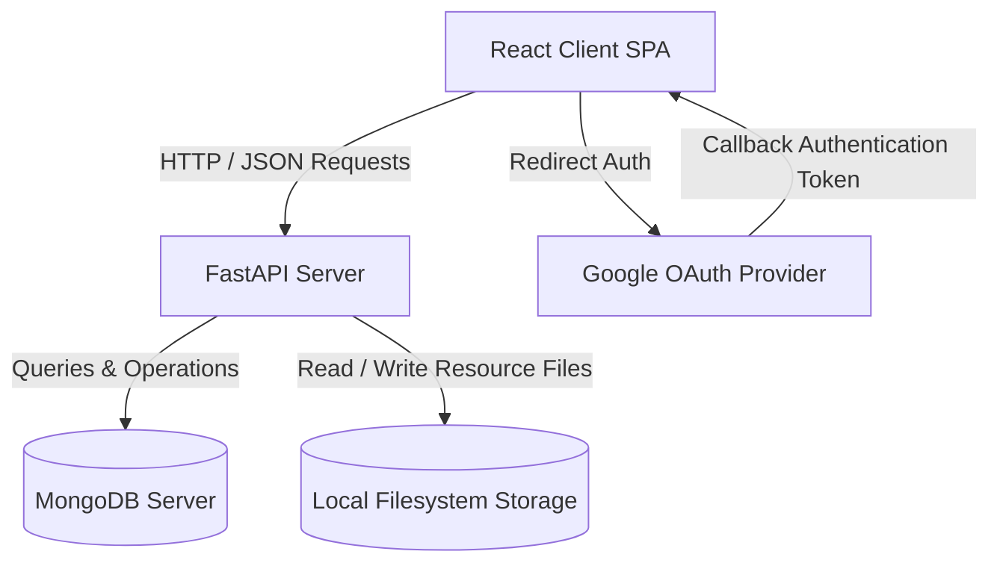

# Attendify — Your Smart Academic Companion

**Version:** v1.0.0  
**Status:** Engineering Complete & Feature Frozen  
**Last Updated:** 2026-07-12  

---

## Revision History

| Date | Version | Description | Author |
|---|---|---|---|
| 2026-07-12 | v1.0.0 | Initial release compilation & documentation structuring | Principal Software Architect |

---

## Table of Contents
1. [Introduction](#1-introduction)
2. [Core Tech Stack](#2-core-tech-stack)
3. [System Architecture Overview](#3-system-architecture-overview)
4. [Repository Structure](#4-repository-structure)
5. [Quick Start (Local Developer Setup)](#5-quick-start-local-developer-setup)
6. [Documentation Suite Index](#6-documentation-suite-index)

---

## 1. Introduction

Attendify is a modern, lightweight, and responsive academic attendance and resource management system designed to streamline class tracking, resource sharing, and notifications. 

The application segregates access into two distinct portals:
* **Admin Portal**: Managed by verified administrators (with oversight by a Super Admin) to create classes, mark/edit attendance, publish timetables and academic announcements, and share study resources.
* **Student Portal**: Accessed by students via roll numbers to monitor their daily attendance stats, browse and preview uploaded files, receive immediate academic alerts, and check timetables.

---

## 2. Core Tech Stack

* **Backend**: FastAPI (Python 3.12+), Motor (Async MongoDB Driver), Pydantic v2 (Data Validation), Uvicorn (ASGI Web Server).
* **Frontend**: React 18, React Router v7, Axios, Tailwind CSS, Radix UI.
* **Database**: MongoDB (v6.0+).
* **Authentication**: Cookie-based sessions (HTTP-Only, SameSite config), Google OAuth (Admin flow), bcrypt password hashing (Student flow).

---

## 3. System Architecture Overview



---

## 4. Repository Structure

```
Attendify/
├── Backened/                     # FastAPI Backend Application
│   ├── scripts/                  # Data migration and seeding scripts
│   ├── tests/                    # Backend unit & integration tests
│   ├── resource_storage/         # Uploaded resource file storage
│   ├── timetable_storage/        # Timetable image storage
│   ├── server.py                 # Main application entry point
│   ├── requirements.txt          # Python environment dependencies
│   └── .env                      # Local backend configuration template
│
├── Frontend/                     # React Single Page Application
│   ├── public/                   # Static browser assets
│   ├── src/
│   │   ├── components/           # Reusable UI controls, ErrorBoundary, Layout
│   │   ├── context/              # Authentication contexts
│   │   ├── pages/                # Admin and Student workflow screens
│   │   └── utils/                # API client helpers & resource handlers
│   ├── package.json              # NPM dependencies & scripts
│   └── craco.config.js           # Build tool configs (CRACO)
│
├── docs/                         # Professional Documentation Suite (Locked)
└── README.md                     # Project Master Landing Page
```

---

## 5. Quick Start (Local Developer Setup)

For detailed deployment parameters, refer to the [Installation Guide](file:///c:/Users/acer/Documents/Attendify_Workspace/frontend/public/Harish's%20Creation/Attendify/Frontend/public/Attendify-vs%20code/docs/09_installation_guide.md).

### A. Run Backend
1. Enter the `Backened/` directory.
2. Initialize virtual environment:
   ```bash
   python -m venv venv
   source venv/bin/activate  # Or venv\Scripts\activate on Windows
   ```
3. Install dependencies:
   ```bash
   pip install -r requirements.txt
   ```
4. Start development server:
   ```bash
   uvicorn server:app --reload --port 8000
   ```

### B. Run Frontend
1. Enter the `Frontend/` directory.
2. Install dependencies:
   ```bash
   npm install
   ```
3. Start development server:
   ```bash
   npm start
   ```

---

## 6. Documentation Suite Index

Below is the directory of all 20 system, engineering, operations, and manual documents for Attendify V1.

| Document # | Document Title | Description | File Path |
|:---:|---|---|---|
| **01** | **Product Requirements Document (PRD)** | Core product features, objectives, and user roles | [01_prd.md](file:///c:/Users/acer/Documents/Attendify_Workspace/frontend/public/Harish's%20Creation/Attendify/Frontend/public/Attendify-vs%20code/docs/01_prd.md) |
| **02** | **Software Requirements Specification (SRS)** | System interfaces, constraints, and functional specs | [02_srs.md](file:///c:/Users/acer/Documents/Attendify_Workspace/frontend/public/Harish's%20Creation/Attendify/Frontend/public/Attendify-vs%20code/docs/02_srs.md) |
| **03** | **System Design Document** | Module layouts, component boundaries, and interactions | [03_system_design.md](file:///c:/Users/acer/Documents/Attendify_Workspace/frontend/public/Harish's%20Creation/Attendify/Frontend/public/Attendify-vs%20code/docs/03_system_design.md) |
| **04** | **Architecture Document** | Data flow design, routing lifecycle, state handlers | [04_architecture.md](file:///c:/Users/acer/Documents/Attendify_Workspace/frontend/public/Harish's%20Creation/Attendify/Frontend/public/Attendify-vs%20code/docs/04_architecture.md) |
| **05** | **Database Design** | Mongo collections, indexes, structure schemas, and relationships | [05_database_design.md](file:///c:/Users/acer/Documents/Attendify_Workspace/frontend/public/Harish's%20Creation/Attendify/Frontend/public/Attendify-vs%20code/docs/05_database_design.md) |
| **06** | **API Documentation** | REST HTTP endpoints, payload contracts, and error profiles | [06_api_documentation.md](file:///c:/Users/acer/Documents/Attendify_Workspace/frontend/public/Harish's%20Creation/Attendify/Frontend/public/Attendify-vs%20code/docs/06_api_documentation.md) |
| **07** | **Security Documentation** | Session cookie configuration, OAuth verification, rate limiting | [07_security_documentation.md](file:///c:/Users/acer/Documents/Attendify_Workspace/frontend/public/Harish's%20Creation/Attendify/Frontend/public/Attendify-vs%20code/docs/07_security_documentation.md) |
| **08** | **Installation Guide** | Environment preparations, dependencies, and database migrations | [08_installation_guide.md](file:///c:/Users/acer/Documents/Attendify_Workspace/frontend/public/Harish's%20Creation/Attendify/Frontend/public/Attendify-vs%20code/docs/08_installation_guide.md) |
| **09** | **Deployment Guide** | Production environment guides, SSL configs, scaling constraints | [09_deployment_guide.md](file:///c:/Users/acer/Documents/Attendify_Workspace/frontend/public/Harish's%20Creation/Attendify/Frontend/public/Attendify-vs%20code/docs/09_deployment_guide.md) |
| **10** | **User Manual (Student)** | Visual walk-through of the student dashboard features | [10_user_manual.md](file:///c:/Users/acer/Documents/Attendify_Workspace/frontend/public/Harish's%20Creation/Attendify/Frontend/public/Attendify-vs%20code/docs/10_user_manual.md) |
| **11** | **Admin Manual** | Details on managing classes, attendance sheets, and resources | [11_admin_manual.md](file:///c:/Users/acer/Documents/Attendify_Workspace/frontend/public/Harish's%20Creation/Attendify/Frontend/public/Attendify-vs%20code/docs/11_admin_manual.md) |
| **12** | **Super Admin Manual** | Directives for managing administrator access permissions | [12_super_admin_manual.md](file:///c:/Users/acer/Documents/Attendify_Workspace/frontend/public/Harish's%20Creation/Attendify/Frontend/public/Attendify-vs%20code/docs/12_super_admin_manual.md) |
| **13** | **Testing Report** | Smoke tests, unit verifications, and compliance assertions | [13_testing_report.md](file:///c:/Users/acer/Documents/Attendify_Workspace/frontend/public/Harish's%20Creation/Attendify/Frontend/public/Attendify-vs%20code/docs/13_testing_report.md) |
| **14** | **Production Readiness Report**| Stabilization details, security configurations, and final score | [14_production_readiness_report.md](file:///c:/Users/acer/Documents/Attendify_Workspace/frontend/public/Harish's%20Creation/Attendify/Frontend/public/Attendify-vs%20code/docs/14_production_readiness_report.md) |
| **15** | **Feature Freeze Document** | Frozen status matrices, validation gates, release standards | [15_feature_freeze_document.md](file:///c:/Users/acer/Documents/Attendify_Workspace/frontend/public/Harish's%20Creation/Attendify/Frontend/public/Attendify-vs%20code/docs/15_feature_freeze_document.md) |
| **16** | **Release Notes (v1.0.0)** | Launch capabilities summary and bug-fix summary logs | [16_release_notes_v1.0.0.md](file:///c:/Users/acer/Documents/Attendify_Workspace/frontend/public/Harish's%20Creation/Attendify/Frontend/public/Attendify-vs%20code/docs/16_release_notes_v1.0.0.md) |
| **17** | **Known Limitations** | Architectural boundaries and resource bounds of the V1 core | [17_known_limitations.md](file:///c:/Users/acer/Documents/Attendify_Workspace/frontend/public/Harish's%20Creation/Attendify/Frontend/public/Attendify-vs%20code/docs/17_known_limitations.md) |
| **18** | **Maintenance Guide** | Daily database backup scripts, recovery plans, and log management | [18_maintenance_guide.md](file:///c:/Users/acer/Documents/Attendify_Workspace/frontend/public/Harish's%20Creation/Attendify/Frontend/public/Attendify-vs%20code/docs/18_maintenance_guide.md) |
| **19** | **V2 Backlog** | Roadmap for high-availability scaling, Redis cache, and S3 | [19_v2_backlog.md](file:///c:/Users/acer/Documents/Attendify_Workspace/frontend/public/Harish's%20Creation/Attendify/Frontend/public/Attendify-vs%20code/docs/19_v2_backlog.md) |
| **20** | **Project README** | This document | [README.md](file:///c:/Users/acer/Documents/Attendify_Workspace/frontend/public/Harish's%20Creation/Attendify/Frontend/public/Attendify-vs%20code/README.md) |
