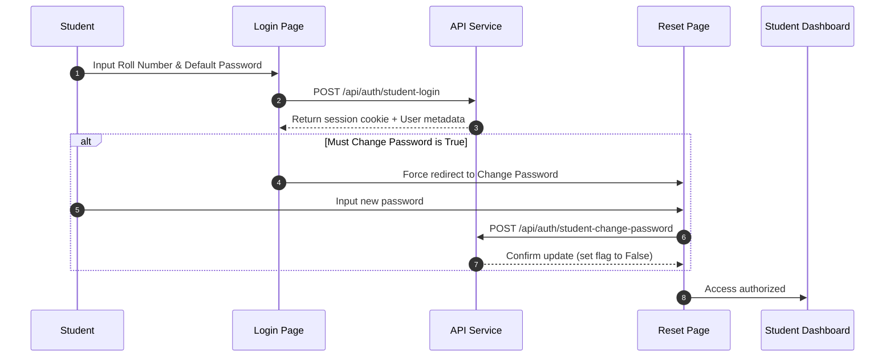

# Product Requirements Document (PRD) — Attendify

**Version:** v1.0.0  
**Status:** Engineering Complete & Feature Frozen  
**Last Updated:** 2026-07-12  

---

## Revision History

| Date | Version | Description | Author |
|---|---|---|---|
| 2026-07-12 | v1.0.0 | Initial compilation of product specifications matching the final V1 implementation. | Principal Software Architect |

---

## Table of Contents
1. [Product Overview](#1-product-overview)
2. [Target Personas](#2-target-personas)
3. [Core Feature Scope & Functional Requirements](#3-core-feature-scope--functional-requirements)
4. [User Workflows](#4-user-workflows)
5. [Non-Functional Requirements](#5-non-functional-requirements)
6. [Assumptions & Constraints](#6-assumptions--constraints)
7. [Success Criteria](#7-success-criteria)
8. [Out of Scope (V2 Backlog)](#8-out-of-scope-v2-backlog)

---

## 1. Product Overview

### 1.1 Purpose
Attendify is a centralized portal developed to simplify academic attendance management and resource coordination within educational institutions. By replacing manual paperwork and fragmented communication channels, Attendify provides real-time visibility into attendance statistics, direct sharing of class materials, and critical scheduling updates.

### 1.2 Core Value Proposition
* **Transparency**: Students have instant access to their attendance records, history, and eligibility.
* **Streamlined Workflows**: Instructors can record attendance, manage timetables, and upload study resources for their classes from a unified interface.
* **Timely Alerts**: Automated notification triggers ensure students stay updated on timetable changes, new files, announcements, and attendance shortages.

### 1.3 Goals & Objectives
* **Eliminate Paper-based Tracking**: Shift attendance management entirely online to save faculty time and prevent data loss.
* **Reduce Attendance Disputes**: Empower students with a daily personal ledger to notice errors immediately rather than at semester's end.
* **Streamline Communications**: Centralize updates, announcements, and notes so students do not miss notifications.

---

## 2. Target Personas

| Persona | Role in System | Key Requirements |
|---|---|---|
| **Student** | Consumer of portal resources and statistics. | • View dashboard attendance percentages and eligibility status. • View today's marked attendance and past attendance history. • Access and preview lecture notes/resources. • Receive real-time alerts regarding timetables, assignments, and attendance limits. |
| **Class Admin (Faculty/Instructor)** | Manager of specific academic classes and cohorts. | • Create class codes and manage class properties. • Enroll/register students or configure a shareable class join link. • Mark and modify period-by-period daily attendance. • Upload, update, and categorize academic resources. • Upload and update class timetables. • Publish announcements and academic updates. |
| **Super Admin** | Master administrator. | • Oversee and manage the list of authorized faculty email addresses (Approved Admins). |

---

## 3. Core Feature Scope & Functional Requirements

Every feature described below corresponds exactly to the implemented V1 codebase:

### 3.1 Authentication & Profile Module
* **Admin Authentication**: Handled via external Google OAuth redirection. The admin's email must be pre-approved by the Super Admin in the `approved_admins` registry.
* **Student Authentication**: Log in using a combination of a class-specific `Roll Number` and password.
* **Force Password Change**: Upon first-time login (onboarded students), the system redirects students to a mandatory password reset screen before allowing access to the dashboard.
* **Session Persistence**: Sessions are tracked via secure HTTP-Only cookies (`auth_token`).
* **Profile Management**: Profile pages display names, roles, associated classes, and overall statistics. Students can update their passwords directly from their profile.

### 3.2 Class Management Module
* **Class Lifecycle**: Admins can create classes, rename them, and delete them (if authorized).
* **Class Join Codes**: Admins can toggle a class `join_code` to allow students to self-enroll.
* **Join Links**: Toggling the join links generates copyable registration URLs.

### 3.3 Attendance Tracking Module
* **Attendance Ledger**: Period-by-period (up to class limit) attendance sheets for specific dates.
* **Attendance Statuses**: Present, Absent, and Late.
* **Attendance Checks**: Prevents marking duplicate attendance records for the same class/student/date/period.
* **Export Utilities**: Export attendance records and eligibility spreadsheets as CSV.

### 3.4 Resource & Timetable Sharing Module
* **Category Organization**: Resource folders grouped by Admin-defined Subject names and Categories.
* **File Uploads**: Supports streaming uploads for large files with a strict 50 MB boundary size-check.
* **Document Actions**: View details, copy download link, delete, rename, and preview (supported mime types like PDF, images).
* **Timetable Uploads**: Visual timetable schedules supporting image uploads and audit histories.

### 3.5 Communication & Alerts Module
* **Announcements Board**: Publish class announcements that trigger real-time student notification alerts.
* **Academic Updates Section**: Grouped academic notices: Tomorrow's Tests, What to Study, Pending Work, Faculty Instructions, and Missed While Absent.
* **Notification System**: Notification bell in the student navigation bar displaying read and unread messages.

---

## 4. User Workflows

### 4.1 Student Onboarding & Login Lifecycle

### 4.2 Class Creation & Student Self-Join Flow
1. **Admin** logs in via Google Auth.
2. **Admin** clicks "Create Class", enters metadata (Name, Code, Max Students, Periods/Day), and saves.
3. **Admin** toggles "Join Link" to enabled state.
4. **Student** navigates to the join URL (`/join/:joinCode`), enters name, roll number, and submits.
5. **System** registers student under the class, sets their default password as their roll number, and marks their account as requiring a password change on first login.

---

## 5. Non-Functional Requirements

### 5.1 Performance & Scalability
* **Page Loading**: Dynamic loading states wrapped with a unified visual `<LoadingScreen>` layout.
* **Single-Node Execution Limit**: Designed strictly for single-node deployments owing to local disk file storage.

### 5.2 Security & Data Protection
* **Session Integrity**: Session cookies utilize HTTP-Only, SameSite, and conditionally-forced `Secure` parameters.
* **Storage Guards**: Rate limits applied to authentication and file upload operations.
* **Database Constraints**: Prevents duplicate entries using unique compound database indexes.

### 5.3 Accessibility
* **Screen Reader Support**: Active screen elements like icon-only buttons include descriptive `aria-label` attributes.

---

## 6. Assumptions & Constraints

### 6.1 System Assumptions
* **SMTP Access**: The system assumes access to a valid SMTP service for executing internal communications when configuring notifications.
* **Student Identity Boundaries**: It is assumed that a student belongs to one or more classes within the institution, identified by a roll number that is unique *within each class* (not necessarily globally).

### 6.2 Implementation Constraints
* **Single-Server Limitation**: Must run on a single machine/container because uploads are stored on the local disk and rate-limits are kept in-memory.
* **Google OAuth Mandate**: Class admins must possess a Gmail/Google workspace account that has been explicitly authorized by the Super Admin.

## 7. Success Criteria
* **Zero Lost Records**: 100% preservation of attendance markings using MongoDB's transactional guarantees.
* **Consistent Response Times**: Core student dashboard loads in under 1 second under standard load conditions.
* **Accessibility Compliance**: Critical navigational pathways must be completely accessible via keyboard navigation and screen readers.

## 8. Out of Scope (V2 Backlog)

The following items are explicitly excluded from the V1 release candidate scope:
1. **Multi-Node Deployment support**: Clustered execution requiring Redis shared cache and S3-compatible cloud storage.
2. **Advanced Analytics & Visual Reporting**: Graphs and trends charts for attendance tracking.
3. **Push Notifications**: Mobile push notifications or email-based alerts.
