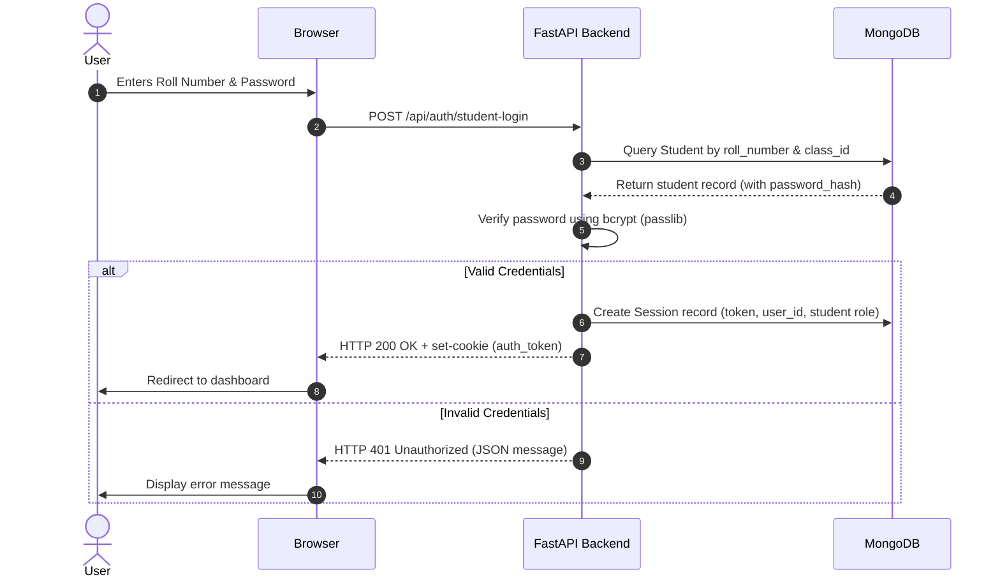

# System Design Document — Attendify

**Version:** v1.0.0  
**Status:** Engineering Complete & Feature Frozen  
**Last Updated:** 2026-07-12  

---

## Revision History

| Date | Version | Description | Author |
|---|---|---|---|
| 2026-07-12 | v1.0.0 | Initial compilation of system design specs based on implemented V1 architecture. | Principal Software Architect |

---

## Table of Contents
1. [System High-Level Architecture](#1-system-high-level-architecture)
2. [Component Decomposition](#2-component-decomposition)
3. [Core Process Flows & Workflows](#3-core-process-flows--workflows)
4. [Design Decisions & Technical Rationale](#4-design-decisions--technical-rationale)

---

## 1. System High-Level Architecture

Attendify V1 uses a classic client-server model split into an independent Single Page Application (SPA) frontend and a monolithic FastAPI backend. 

```
                               ┌───────────────────────────┐
                               │       React Client        │
                               │  (Axios Client + Router)  │
                               └─────────────┬─────────────┘
                                             │
                                             │ HTTPS API Calls (JSON / Form-Data)
                                             ▼
                               ┌───────────────────────────┐
                               │      FastAPI Server       │
                               │     (Backened/server.py)  │
                               └──────┬──────────────┬─────┘
                                      │              │
                    DB Operations     │              │ Local File Reads/Writes
                    (Motor Driver)    ▼              ▼
                              ┌──────────┐     ┌───────────┐
                              │ MongoDB  │     │ Disk      │
                              │ Database │     │ Directory │
                              └──────────┘     └───────────┘
```

---

## 2. Component Decomposition

### 2.1 Backend Monolith (`Backened/server.py`)
The backend is structured as a single-file application to simplify dependency execution and local VMs deployment:
* **API Routing layer (`APIRouter`)**: Configures all endpoints under `/api`. Handles parameters, request-body parsing, and validation using Pydantic models.
* **Security & Auth Middleware**:
  * `_security_headers_middleware`: Inserts HTTP response headers (`X-Frame-Options`, `X-Content-Type-Options`, `X-XSS-Protection`, `Referrer-Policy`).
  * `_InMemoryRateLimiter`: Sliding-window dictionary protecting authentication endpoints from denial-of-service and brute force attempts.
* **Storage Drivers**:
  * `db`: MongoDB async connection pool managed via the `motor` driver.
  * `timetable_storage` & `resource_storage`: Local file handlers managing storage directory reads/writes.

### 2.2 Frontend SPA (`Frontend/src/`)
The frontend organizes visual flows into modular components:
* **Core Layout Provider (`Layout.jsx`)**: Renders desktop sidebar navigations, mobile drawer layers, and the active student notifications dropdown indicator.
* **Authentication Provider (`AuthContext.js`)**: Tracks user roles (`admin` or `student`) and executes auth checks (`/api/auth/me`).
* **HTTP Client (`api.js`)**: Configures Axios globally to pass cookies (`withCredentials: true`) and intercept `401 Unauthorized` responses to redirect users to `/login`.
* **Error boundary (`ErrorBoundary.jsx`)**: Catch rendering errors and display a clean glassmorphic recovery layout.

---

## 3. Core Process Flows & Workflows

### 3.1 Authentication Lifecycle



### 3.2 Attendance Marking & Verification Flow
1. **Marking Request**: The faculty user selects a class, date, and period, then checks student boxes.
2. **API Verification**: The endpoint `POST /api/attendance` validates the admin owns the target class.
3. **Database Write**: It executes an upsert operation. MongoDB enforces uniqueness using a compound index on `(class_id, student_id, date, period_number)`, preventing duplicate attendance entries.
4. **Calculations**: Fetching reports triggers a database aggregation pipeline that compiles present and late records, returning total eligibility percentages to the frontend.

### 3.3 Resource Management File Upload Flow
1. **Upload Request**: The admin uploads a file via a multipart form.
2. **Size Enforcement**: The API intercepts the stream and checks that file content is $\le 50\text{ MB}$.
3. **Streaming Write**: The file is streamed to the local directory `Backened/resource_storage/`.
4. **Database Registration**: The file's metadata is stored in the `resources` collection. If writing to database fails, the server deletes the partially written file from the directory to clean up space.

---

## 4. Design Decisions & Technical Rationale

### 4.1 Single-File Backend Architecture
* **Decision**: All API routers, Pydantic validation schemas, and database connectors are written in `Backened/server.py`.
* **Rationale**: Simplifies deployment and reduces configuration overhead. It makes code searches for security audits faster and ensures all dependencies are imports-safe without complex module setups.

### 4.2 In-Process Memory Rate Limiting
* **Decision**: Sliding window limits are tracked using a local Python dictionary.
* **Rationale**: Avoids the dependency and latency of a Redis/Memcached cluster. For the V1 single-node deployment target, in-process dictionaries are fast, safe, and require zero additional infrastructure setup.

### 4.3 Class-Scoped Student Unique Keys
* **Decision**: Enforces unique constraints on `(class_id, roll_number)` rather than globally.
* **Rationale**: Allows the same student to exist in multiple classes (e.g., in departmental joint programs), which is a key requirement of the V1 architecture.

### 4.4 Local Disk File Storage
* **Decision**: Uploaded files and timetables are saved directly to local directory paths on the server host.
* **Rationale**: Eliminates the cost, latency, and integration complexity of third-party cloud object storage (like AWS S3) for V1 deployments.
